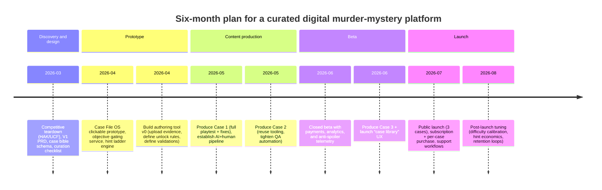

# Digital Murder Mystery App Deep Research Report

## Executive summary

A strong digital replication of **Hunt A Killer** and **Unsolved Case Files** is less about “AI-generated mysteries” and more about faithfully reproducing three experiential pillars: **authentic evidence handling**, **structured progress gates**, and **controlled revelation pacing**. Hunt A Killer’s experience is driven by episodic “TV-season” cadence (commonly 6 episodes) with layered evidence, puzzles/ciphers, and a robust “Hints & Reveals” support system that is *item-level*, password-gated, and includes inventory, recaps, accessibility, and step-by-step solutions. citeturn8view2turn8view3turn16search0 Unsolved Case Files is built around a **three-objective** structure with an **online answer key that validates without spoiling**, and an **explicit “bonus envelope” mechanic** that delivers new evidence only after an objective is solved. citeturn23view0turn1view5turn16search1

For a fully digital app, the closest analogue is a **“Case File OS”**: a desktop-like interface where players sift documents/photos/audio, build a suspect board, and unlock new evidence drops via objective validation and tiered hints. This “OS” should emulate Hunt A Killer’s virtual desktops / in-world websites and Unsolved Case Files’ answer-key gates and progressive evidence packets. citeturn8view2turn20view0turn23view0

From a production and risk standpoint, the highest-leverage choice is **curated pre-generation** (AI-assisted drafting + human curation + playtesting) with **minimal runtime generation**. This mirrors how both brands preserve solvability and avoid “hallucinated” contradictions. It also materially reduces piracy and long-term maintenance risk (players have already reported dependence on online components and concern when those components change or disappear). citeturn20view0turn1view4turn8view3

Key recommendation for V1 (mobile + desktop web, solo/asynchronous): launch with **3 curated cases** that each use **3 objective gates** (UCF-like) and optionally support **6-episode pacing flags** (HAK-like) as a scheduling layer. Build a content “case bible” schema that ensures every gate has deterministic proof checks, tiered hints, and a locked solution graph. citeturn23view0turn8view3turn16search7

## Research approach and assumptions

This report prioritizes the sources you requested: official Hunt A Killer and Unsolved Case Files pages (how-to-play, portals, FAQs), Cratejoy listings, and community/third-party review surfaces such as Trustpilot, BoardGameGeek, and Reddit, plus competitor sites for broader landscape. citeturn1view2turn1view5turn4view1turn10search1turn11search17turn20view0

Assumptions used where primary sources do not provide explicit numbers:

The report treats a “digital case” as closest to an Unsolved Case Files product: a several-hour investigation anchored by dozens of evidence artifacts and 3 gated objectives. citeturn23view0turn0search8 Where needed, we also model a Hunt A Killer-style “season” as 6 episodes totaling roughly 10–15 hours for a complete box set. citeturn8view2

Reddit visibility can be inconsistent in automated research environments. We were able to retrieve and cite a relevant Reddit thread discussing Hunt A Killer’s online components and archival concerns; broader Reddit review sampling is therefore treated as incomplete. citeturn20view0

## Baseline experience anatomy of Hunt A Killer and Unsolved Case Files

### Hunt A Killer’s defining mechanics

Hunt A Killer frames play as detective work grounded in classic **means, motive, opportunity** reasoning. citeturn1view2 Its modern product line includes “Box Sets” positioned as **6-episode** mysteries, with pricing examples clustering around **$129.99** for full sets. citeturn9view2turn8view2 A representative product page explicitly describes “get all 6 boxes at once” and “10–15 hours of gameplay,” reinforcing the multi-session, long-form arc. citeturn8view2

A key differentiator is the **support infrastructure** that protects pacing while preventing total spoilers. The official “Hints & Reveals” pattern is:

- Access controlled by **a password from the inventory card**
- Item-scoped help: select an item to see only that item’s hint or reveal
- Multiple sections: recap, hints, reveals, inventory/hidden items/hidden text, accessibility, and step-by-step solution walk-through citeturn8view3turn16search0

Hunt A Killer explicitly warns the experience “has layers” and that hints/reveals do **not** expose all answers—encouraging deeper discovery and re-contextualization over time. citeturn8view3turn16search0

In addition, Hunt A Killer seasons often blend physical evidence with digital “world” elements (virtual desktops, portals, and narrative interaction). The Moon Summit box set, for example, links “Player Resources” including a character desktop site and the Hints & Reveals system. citeturn8view2 This is important: it shows Hunt A Killer already uses a hybrid physical+digital pattern you can port into a fully digital “case OS.”

### Unsolved Case Files’ defining mechanics

Unsolved Case Files centers the experience on **three objectives**, validated through an online answer key that lets players “prove they are right” without revealing the answer when they are wrong; if wrong, they can view **up to three hints**. citeturn23view0turn1view5 The official “How It Works” document further explains the pacing engine: after each objective is solved, players open a **bonus envelope** containing the next objective plus additional case evidence; after objective three, the case is solved. citeturn23view0

Evidence density is a marquee value proposition. Official product FAQs state cases include **over 50 investigation documents and photos**, listing concrete evidence types such as newspaper articles, crime scene photographs, evidence reports, phone records, coroner’s reports, fingerprint cards, maps, legal documents, suspect interrogations, witness statements, and character photographs. citeturn0search8

UCF’s support stack is also explicitly designed to preserve the “no spoilers unless requested” ethos. If you enter a wrong answer, you get a hint button, and there is also deeper “Case Help” for additional guidance. citeturn16search7turn16search5

Two operational details matter for your digital-only business model:

- UCF’s site footer states “USPTO PATENT PENDING,” signaling potential IP claims around their mechanics and/or packaging. This is not a conclusion about enforceability, but it is a risk flag that should be reviewed by counsel before you mimic the system too literally. citeturn11search11  
- UCF limits missing-document replacements “to help combat piracy” (they state they can only send missing documents after the first claim). This is a strong indicator that **content leakage/piracy is a known threat** in this category. citeturn1view4

### Comparative view of core mechanics

| Dimension | Hunt A Killer | Unsolved Case Files | Closest digital analogue you should build |
|---|---|---|
| Narrative structure | 6-episode season arcs; “TV” cadence; long-form engagement citeturn8view2turn8view1 | Single case with 3 gated objectives and “bonus envelope” reveals citeturn23view0turn1view5 | Case supports both: 3 objective gates (V1) + optional episode scheduler layer (V2) |
| Gating | Episode-by-episode goals; answer submissions; “contact replies with suggestions” if wrong citeturn16search10turn16search15 | Online answer key validates without spoiling; wrong answers give up to 3 hints citeturn23view0turn1view5 | In-app “Answer Key” that accepts proof inputs + graded hint ladder |
| Hint system | Password-gated; item-level hints vs reveals; recap/inventory/accessibility/solution citeturn8view3turn16search0 | Per-objective hints; additional case-help pages citeturn16search7turn16search5 | Tiered hints at both object and objective layers; strict spoiler controls |
| Evidence style | Physical “props” + digital portals/virtual desktops; puzzles/ciphers citeturn8view2turn8view3 | “Case file” authenticity; 50+ documents/photos; mostly paper-like evidence citeturn0search8turn23view0 | Digital “Case File OS” with scanned-doc feel + interactive artifacts |
| Anti-spoiler posture | “Layers”; hints/reveals not exhaustive citeturn8view3turn16search0 | Validation without spoilers unless hints requested citeturn23view0turn16search7 | Default non-spoiler experience, opt-in hint ladder, and event-logged reveals |

## Digital replication blueprint for features and UX flows

### Product features that best mimic the physical experience

To mimic Hunt A Killer/Unsolved Case Files digitally, focus on **interfaces that replicate physical behaviors**:

A “Case File OS” should ship with:

A document viewer that feels like a mix of scanned evidence and interactive files: newspapers, reports, maps, handwritten notes, photos, “forms,” and audio transcripts. This parallels Hunt A Killer’s multi-section portal approach (including accessibility transcripts) and UCF’s evidence-first, instruction-light philosophy. citeturn8view3turn23view0turn0search8

A suspect board and timeline workspace that makes “deduction work” explicit. Hunt A Killer’s own Hints & Reveals guidance encourages players to organize evidence and even create a murder board. citeturn8view3

An in-app “Answer Key” that validates progress without spoiling. This is the beating heart of Unsolved Case Files’ pacing system. citeturn23view0turn16search7

An item-scoped “Hints vs Reveals” ladder (HAK-style) plus objective-scoped tiers (UCF-style). citeturn8view3turn23view0

A “new evidence drop” mechanic that mimics either UCF’s bonus envelopes or HAK’s monthly episode delivery. citeturn23view0turn8view1

An “in-world” layer: emails/messages, faux systems, and sitelets (like virtual desktops) that make the mystery feel real—while controlling spoilers. This is already common in hybrid physical/digital mysteries and explicitly present in Hunt A Killer’s ecosystem. citeturn8view2turn20view0

### Recommended V1 UX flows

Your V1 should default to a UCF-like three-objective structure, because it provides a clean, digital-native gating mechanism and is already validated in-market. citeturn23view0turn16search1 Build the “HAK feel” as presentation and pacing (desktop metaphor, layered hints, narrative messaging, optional episodic release) rather than rigidly copying subscription-box logistics. citeturn8view3turn8view1

A V1 solo/asynchronous flow:

Case creation: user chooses “New Case,” selects difficulty, content warnings, and pacing mode (single-sitting vs drip over days). (Pacing mode is consistent with your updated requirement that a scenario can be played over time.) citeturn23view0

Onboarding: “Detective briefing” + rules-of-engagement (“no specific steps; develop your process”), matching UCF’s “no instructions” ethos—while still teaching UI. citeturn23view0

Investigation loop: open evidence → tag highlights → add to suspect board/timeline → attempt objective answer → receive “validated / not yet” feedback → choose hint tier if stuck. citeturn23view0turn16search7

Objective completion: trigger “Evidence Drop” (bonus envelope analogue) + recap. citeturn23view0turn8view3

Case end: final accusation + explanation mode (opt-in) that shows the reasoning chain; preserve a “no spoilers until you ask” discipline. citeturn8view3turn23view0

## Evidence density, objective gating, hints, and pacing mechanics

### Evidence density and types you should emulate

Unsolved Case Files provides the clearest official evidence taxonomy: 50+ evidence photos and documents, including administrative artifacts (phone records, coroner reports, fingerprint cards), narrative artifacts (letters, newspaper articles), and interpersonal testimony (interrogations, witness statements). citeturn0search8 This implies that a digital case must not be “a story chat,” but a **document-powered investigation**.

Hunt A Killer’s product pages emphasize multi-hour playtime, puzzles/ciphers, reconstructing movements/motives/opportunity, and “player resources” like virtual desktops. citeturn8view2 Their official portal UX (hints/recaps/inventory/hidden items/accessibility/solutions) implies many more “micro-assets” per episode than a typical narrative game: every evidence artifact may require a hint ladder, reveal, and sometimes transcription. citeturn8view3

A practical “digital-equivalent evidence pack” should include both “static documents” and a smaller number of “interactive artifacts” (audio, searchable logs, chat transcripts, maps).

### Objective gating mechanics that feel fair

Unsolved Case Files’ gating is effective because it:

- Requires players to “prove” the solution via questions
- Does not reveal the right answer when wrong
- Offers up to three hints when wrong citeturn23view0turn1view5

Digitally, the strongest emulation is an “Answer Key” service that supports multiple proof formats:

Multiple-choice where distractors are plausible (better for mobile).
Short-text entry with fuzzy matching and aliases (higher realism but more false negatives).
Evidence-based proof: “select which two documents prove this claim” (best for reducing guesswork and limiting search-engine shortcuts).

Hunt A Killer’s comparable dynamic is “submit an answer; if incorrect, your contact replies with suggestions,” which you can translate into an in-app “handler” message that nudges without revelation. citeturn16search10turn16search15

### Hint and reveal system design

To replicate both brands, design a two-dimensional hint model:

Item-level ladder (HAK-style): each artifact may have a hint and a reveal, and the UI should only show help for the artifact the player selected. citeturn16search0turn8view3  
Objective-level ladder (UCF-style): each objective has 1–3 hints and a final “one last hint” / reveal gate. citeturn23view0turn16search5

This hybrid ladder directly mirrors what the official UCF “Case Help” pages do: progressive hints and an explicit “still lost → final hint” pattern. citeturn16search5turn16search3

### Episodic pacing in a digital world

Hunt A Killer’s six-episode arc and “keep you guessing every month” cadence is a retention engine; the brand also explicitly frames mid-season twists and escalating reveals across episodes. citeturn8view1turn8view2 In digital form, you can mimic this without shipping boxes by using:

Timed evidence drops (daily/weekly) even if the player started the case earlier.
Opt-in “binge mode,” where drops unlock immediately (important for single-sitting users, and consistent with your updated requirement). citeturn23view0  
Between-episode narrative messaging (emails/texts/inbox messages). (Hunt A Killer players already treat online components and communications as part of the experience.) citeturn20view0turn8view2

## Monetization, retention, and piracy mitigation

### Pricing and subscription patterns observed in-market

Hunt A Killer offers full box sets (6 episodes) priced around $129.99 on its store, which implies a premium “season” value framing. citeturn9view2turn8view2 Their Cratejoy listing markets it as a six-episode story delivered over time, reinforcing subscription psychology (“pay monthly, get episodic story”). citeturn4view1

Unsolved Case Files, by contrast, is positioned like a retail entertainment product (“ultimate dinner party or date night murder mystery game”) and is sold broadly; its origin story explicitly references building cases to sell on Amazon and later expanding to major retailers. citeturn6view1

Competitor price anchors (useful for your digital pricing tests):

Cryptic Killers positions “case file games” at **£19.99** total, ~3 hours playtime, and emphasizes pause/resume flexibility (very aligned with digital). citeturn36search0  
Unsolved (UK) lists cases around **£30.00** and markets “blockbuster-quality murder mysteries” with physical evidence packs. citeturn36search20  
Deadbolt Mystery Society markets a monthly delivered standalone box with interactive online components via QR code (hybrid again). citeturn36search3turn36search7

Implication: a digital-only product can plausibly price as either:

“Per case” at ~$12–$25 (UCF/Cryptic Killers analogue), or
“Season pass” at ~$60–$130 depending on episode count and production value (HAK analogue). citeturn9view2turn36search0

### Retention and engagement tactics that fit the category

The category’s retention playbook is structurally tied to pacing:

Episode drops and cliffhangers (HAK’s season framing). citeturn8view1turn8view2  
Objective gating with new evidence injections (UCF bonus envelopes). citeturn23view0  
Community discussion (but with strict spoiler segmentation). Hunt A Killer explicitly routes users to community properties like an official Facebook group. citeturn8view1

In a digital-first subscription, the most transferable tactics are:

A “streak” around investigation sessions (but do not punish binge users; provide both).
Post-objective “case recap” summaries (mirroring HAK recaps). citeturn8view3  
Achievements tied to “no hints used,” “all hidden items found,” etc.—consistent with HAK’s emphasis on hidden items/hidden text layers. citeturn8view3

### Piracy mitigation in a digital-only product

You cannot fully stop copying, but you can reduce the value of leaked assets and increase the cost of mass exfiltration.

Signals from incumbents:

UCF explicitly limits missing-document replacement to help combat piracy. This is a strong indicator that document bundles are frequently copied/shared. citeturn1view4  
A Reddit thread highlights user concern about preservation/archival of Hunt A Killer’s online components, including interactive sitelets and passworded hint portals, reinforcing that digital narrative components can be extracted or break over time. citeturn20view0

Recommended mitigations for your app:

Serve documents as signed URLs with short TTL; add per-user watermark overlays (email hash, purchase ID) on every page render.
Make “answer key” and “hint” systems server-side and personalized (leaked PDFs without validation won’t complete the experience).
Throttle bulk downloads; selectively allow offline packs for premium tiers with aggressive watermarking.
Design “interactive artifacts” (searchable databases, chat logs, audio) that are harder to pirate than static PDFs.

A key design principle: **piracy mitigation should not degrade legitimate UX**; UCF’s own missing-doc limitation is narrow (replacements) rather than punishing normal play. citeturn1view4

## Content pipeline, AI cost model, scalability, and legal or moderation risks

### Content production pipeline for AI-assisted but curated cases

Unsolved Case Files’ “Our Story” underscores that turning a case file into an interactive, authentic-feeling game took months of brainstorming and iteration, and that they built a structured multi-step process plus an online answer key to validate without spoiling. citeturn6view1 This directly supports the idea that “AI-generated” must still be **designed**—not just generated.

A recommended pipeline:

Case concept and tone check: avoid glorifying killers; UCF explicitly chose not to glorify murderers as part of their brand formation. citeturn6view1  
Case bible creation (ground truth): suspects, timeline, motif, clue graph, objective answers.
Evidence list + generation: create >50 artifacts to match the category’s evidence density expectations. citeturn0search8  
Puzzle design + encoding: integrate ciphers and “hidden text/items” mechanics if you want HAK-like depth. citeturn8view3turn8view2  
Answer key authoring: objective proof forms, accepted aliases, and anti-spoiler policies. citeturn23view0turn16search7  
Hints ladder authoring: item-level + objective-level.
Playtesting + revision: ensure solvability and remove ambiguous gates (a known issue in some community reviews of similar products, e.g., players reporting they got stuck on objectives). citeturn11search17turn10search0

### AI cost estimates for text, voice, and art

OpenAI pricing (selected items relevant to your app economics):

Text (standard processing): `gpt-4o-mini` is listed at $0.15 / 1M input tokens and $0.60 / 1M output tokens (standard). citeturn34view2  
Batch processing is available and is explicitly reflected in pricing tables—use this for offline pre-generation and content QA runs. citeturn34view0turn34view1  
Speech: TTS is priced at $15.00 / 1M characters (and $30.00 / 1M characters for TTS HD), and `gpt-4o-mini-tts` is shown with an estimated cost of ~$0.015 per minute. citeturn35view0  
Image generation: GPT Image 1.5 is priced per image by resolution and quality; for 1024×1024, low is $0.009, medium $0.034, high $0.133. citeturn35view0  
OpenAI’s TTS documentation requires clear disclosure to end users that the voice is AI-generated. citeturn25view2  

Cost implication: for a mystery app, **voice and images dominate variable AI cost**, not text tokens. Meanwhile, pre-generation dramatically reduces variable cost (and reduces correctness risk).

### Pre-generation vs runtime generation tradeoffs

| Approach | Benefits | Risks | When to use |
|---|---|---|---|
| Pre-generated case packs (AI-assisted + human curated) | Lowest per-player cost; deterministic solvability; supports “answer key” validation; best for anti-piracy (harder to leak the whole interactive experience) citeturn23view0turn1view4 | Higher upfront content cost; slower iteration without authoring tools | V1 launch cases; anything marketed as “premium” |
| Runtime-heavy generation (AI creates evidence/hints live) | Infinite novelty; “AI-led” feel | High risk of internal contradictions and unfair gates; higher voice/image cost; can produce copyrighted/real-person artifacts unless constrained | Later “endless mode” only after you have hard safety rails |
| Hybrid (pre-generated core + runtime hint paraphrasing) | Keeps coherence; gives “AI narrator” flavor; contains cost and risk | Still needs guardrails so AI hints don’t invent facts | Best balance for V1 if you want some “AI-led” behavior |

A practical “close-to-HAK/UCF” strategy is: **pre-generate the case file and gates, then allow AI only to (a) paraphrase hints and (b) narrate scripted segments**. This preserves the incumbent experience while letting you say “AI-assisted.”

### Scalability and infrastructure considerations

Because both incumbents are essentially “content engines” with controlled unlocks, your digital architecture should be content-delivery first:

Static assets at scale: documents/photos/audio via object storage + CDN.
Core services: case state, objective gating, hint ladder, user library, payments.
Search and organization: full-text search across evidence; tags; “find similar clue” (optional).
AI services: primarily asynchronous pre-generation (Batch) + lightweight runtime calls for hints. citeturn34view0turn35view0

A long-term maintenance risk unique to digital mysteries is “live dependency rot”: if your case depends on hosted interactive sitelets/APIs, you must commit to maintaining them. Players already worry when online components disappear or break. citeturn20view0 Design around this by keeping “in-world” features fully under your control and versioned per case.

### Legal, IP, and content-moderation risk map

Core risks to account for:

Mechanics copying risk: UCF claims “USPTO PATENT PENDING.” Treat this as a signal to consult IP counsel on how close you can mirror the objective/answer-key interaction. citeturn11search11  
Copyright risks: If AI generates evidence that resembles real copyrighted works (news articles, photos, well-known brands), you need a curation and similarity-check pipeline. Your own updated requirement to avoid copyrighted material is directionally correct.
Defamation/privacy: even fictional cases can accidentally resemble real people or current events; build a “non-real person/place” guardrail and a review checklist.
Voice transparency: disclose AI voices per OpenAI policy when using TTS. citeturn25view2  
Violence/trauma sensitivity: UCF’s founders explicitly wanted not to glorify murderers; tone policies reduce brand risk and widen audience trust. citeturn6view1

## Recommended V1 spec, case bible schema, tech stack, timeline, and next steps

### Recommended V1 feature set

V1 should be “UCF structure with HAK flavor”:

Case File OS UI: evidence inbox, files, photos, audio, suspects, timeline, notes.
Three objective gates per case with in-app answer validation and up to 3 hints. citeturn23view0turn1view5  
Item-level hints/reveals and recap/solution views (locked behind explicit spoiler warnings), mirroring HAK’s portal concept. citeturn8view3turn16search0  
Evidence drops after each objective (“bonus envelope” analogue). citeturn23view0  
Solo + asynchronous sharing: allow exporting a “caseboard link” for friends to view the board (read-only) without full account creation.
Payments and entitlements: monthly subscription that unlocks a rotating set of cases + per-case purchase add-on.

Explicitly out of scope for V1 (but plan for): synchronous multiplayer voice, user-generated cases, and real-time AI-driven plot branching.

### Case bible data model schema

Below is a practical JSON-like “case bible” schema that supports deterministic gates and curated generation. (Field names are suggestions; the key is the separations of truth, evidence, and presentation.)

```json
{
  "case_id": "case_2026_03_ortiga_like",
  "meta": {
    "title": "The Forge at Fairhaven",
    "setting": { "city": "Fictional", "year": 2012 },
    "content_warnings": ["violence_non_graphic"],
    "difficulty": 3,
    "estimated_playtime_minutes": 240
  },
  "ground_truth": {
    "victim": "NPC_ID",
    "killer": "NPC_ID",
    "motive": "…",
    "means": "…",
    "opportunity": "…",
    "timeline": [{ "ts": "2012-05-12T21:13", "event": "…" }],
    "red_herrings": ["…"],
    "canonical_facts": ["fact_id_1", "fact_id_2"]
  },
  "characters": [{
    "npc_id": "npc_anna",
    "role": "suspect|witness|investigator",
    "bio": "…",
    "relationships": [{"to": "npc_bob", "type": "coworker"}],
    "alibis": [{"claim": "…", "status": "true|false|unknown", "proof": ["evidence_id_x"]}]
  }],
  "objectives": [{
    "objective_id": "obj_1",
    "prompt": "Prove the official story is wrong",
    "unlock": { "type": "start" },
    "validation": {
      "type": "proof_set",
      "accepted_answers": ["npc_anna"],
      "required_evidence_refs": ["ev_12", "ev_27"]
    },
    "rewards": {
      "evidence_drop": ["ev_41", "ev_42"],
      "narration_script": "script_obj1_complete"
    },
    "hint_ladder": [
      { "tier": 1, "hint": "…" },
      { "tier": 2, "hint": "…" },
      { "tier": 3, "hint": "…" },
      { "tier": "reveal", "reveal": "…" }
    ]
  }],
  "evidence": [{
    "evidence_id": "ev_12",
    "type": "photo|report|map|recording|handwriting|webpage",
    "title": "Coroner Report",
    "source": "…",
    "unlock_rule": "start|after_obj_1|after_obj_2",
    "content": {
      "text": "…",
      "media_url": "…",
      "transcript": "…"
    },
    "tags": ["time", "injury", "contradiction"],
    "item_hints": [
      { "type": "hint", "text": "…" },
      { "type": "reveal", "text": "…" }
    ]
  }],
  "solution_graph": {
    "nodes": ["fact_id_1", "ev_12", "obj_1"],
    "edges": [{"from": "ev_12", "to": "fact_id_1", "type": "supports"}]
  },
  "qa": {
    "consistency_checks": ["no_real_places", "no_public_figure_names", "no_trademark_logos"],
    "playtest_runs": [{ "date": "2026-04-10", "issues": ["…"] }]
  }
}
```

This schema is designed to enforce the same design constraints incumbents rely on: controlled unlocks, deterministic validation, and multi-layer hints. citeturn23view0turn8view3

### Curation checklist

A V1 “ship gate” checklist should include:

Solvability: each objective has at least two independent supporting evidence links; no objective depends on a single fragile clue. (Aligned with UCF’s “prove it” gating.) citeturn23view0  
Non-spoiler UX: incorrect answer never reveals the solution; only opt-in hints/reveals do. citeturn23view0turn16search7  
Layering: hidden items/hidden text mechanics are optional but, if present, must be explicitly discoverable (HAK’s portal highlights these sections). citeturn8view3  
No real people/places: automated screening + human review.
No copyrighted artifacts: especially “fake newspaper” layouts and photos that resemble real publications.
Accessibility: transcripts for audio, handwriting transcriptions, and readable alternatives—mirroring Hunt A Killer’s accessibility section pattern. citeturn8view3  
Piracy resistance: watermark every rendered artifact; prevent bulk export; limit “support reissues” similarly to UCF’s stance. citeturn1view4

### MVP tech stack

A pragmatic MVP stack:

Frontend: Next.js (React) responsive web app; offline-friendly caching for “documents already opened.”
Backend: Node.js (or Go) service for case state, entitlements, and gating.
Database: Postgres (with full-text search) + optional pgvector for semantic evidence search.
Storage/CDN: S3-compatible object storage + CDN for images/audio.
Auth/payments: Stripe for subscriptions + per-case purchases; entitlement service.
AI services: offline case generation using Batch; runtime hint paraphrasing and optional TTS. citeturn34view0turn35view0

### Six-month timeline with milestones



### Prioritized next steps

Define your “closest-possible” target experience: decide whether V1 feels more like (a) UCF’s single-case three-objective pacing or (b) HAK’s six-episode season. The recommendation is **UCF structure + HAK presentation** for speed and correctness. citeturn23view0turn8view3

Build a one-case vertical slice with full gating and hints before building a “generator.” Unsolved Case Files’ own origin story emphasizes that making a case file interactive is non-trivial and required structured iteration. citeturn6view1

Implement piracy-aware artifact delivery early: watermarking, signed URLs, and server-side validations. Treat UCF’s piracy controls as evidence this is necessary. citeturn1view4

Decide your AI posture: if you want “AI-led,” constrain AI to narration and hint paraphrasing, and keep case facts deterministic. The “layers” philosophy from HAK and the anti-spoiler proof system from UCF both push toward controlled revelation rather than open-ended generation. citeturn8view3turn23view0

Commission initial UI mockups: a “Case File OS” home, evidence viewer states, suspect board, and answer-key modal. Hunt A Killer’s own reliance on virtual desktops and portals suggests this desktop metaphor will resonate. citeturn8view2turn20view0