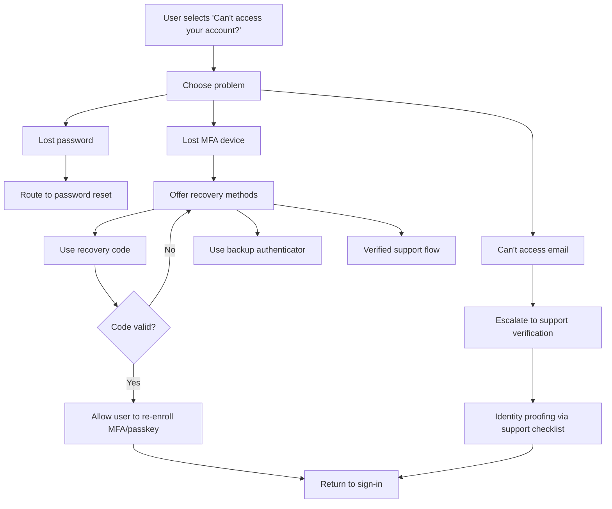

# UX Best Practices for Web App Sign-Up and Authentication

## Executive summary

A high-performing authentication UX balances three competing forces: reduce friction (conversion), reduce risk (security), and reduce harm (privacy + accessibility). The strongest pattern emerging across platform guidance, major identity providers, and security standards is: **use an identifier-first entry**, then **route users to the best available method** (SSO/passkey/password), while **making recovery and session behavior explicit and safe**. Auth0 explicitly describes identifier-first as a two-step flow (enter identifier, then authenticate), mirroring familiar Google-style sign-in. citeturn14search0

Key recommendations to carry into Phase 2 feature development:

Adopt **identifier-first** as the default “front door” for sign-in and sign-up. It supports domain-based routing (enterprise SSO), can converge sign-in and sign-up into one coherent path, and aligns with modern provider tooling (Auth0 Universal Login supports identifier-first; Okta widget flows commonly begin with identifier capture). citeturn14search0turn14search7

Treat passwords as a supported—but not privileged—option. Current NIST guidance emphasizes *usability-forward password rules*: allow password managers and paste, allow long passwords/passphrases (at least 64 characters), and avoid composition rules that drive predictable user behavior. citeturn10view3turn15search8 Baymard’s UX research similarly links overly complex password requirements to abandonment and downstream reset friction. citeturn8search10

Make **phishing-resistant authentication** (passkeys/WebAuthn/FIDO2) a strategic goal: NIST’s AAL2 requires offering a phishing-resistant option, and Okta explicitly characterizes Okta FastPass and FIDO2 (WebAuthn) authentication as phishing resistant (with some platform constraints). citeturn9view0turn7search9 Complement this with FIDO Alliance passkey UX design guidelines to improve adoption and consistency. citeturn3search7

Design recovery as a first-class UX system, not an afterthought. OWASP highlights password reset as a common vulnerability area (notably user enumeration), and Cognito documents specific behavior constraints like reset attempt limits and OTP validity windows (e.g., reset code validity of one hour; throttling in the forgot password flow). citeturn2search0turn0search3turn15search2

Treat sessions and logout as part of UX quality (trust) and security. Use standards-based logout where applicable (OpenID Connect RP-Initiated Logout), and provide a clear UI affordance to sign out / switch accounts (Microsoft explicitly calls this out as a navigation “DO”). citeturn5search32turn13view1

## Foundations that should govern every auth screen

This section defines cross-cutting conventions (layout, copy, accessibility, instrumentation, and security/privacy “guardrails”) that every sign-up / sign-in / recovery screen should implement consistently.

### Global entry points, page architecture, and state-aware navigation

Use a stable, high-visibility entry point in the app chrome (usually top-right): **“Sign in”** when logged out; **avatar + account menu** when logged in. Hide or de-emphasize “Sign up” when a user already has an authenticated session (avoid confusion and accidental account duplication). Microsoft’s branding guidance for sign-in experiences also stresses providing a way to sign out and switch accounts. citeturn13view1

Keep authentication pages visually minimal and predictable: a centered card, 1 primary CTA per step, 1–2 secondary links (e.g., “Forgot password?”, “Create account”), and optional SSO buttons. For provider buttons, follow each platform/provider’s prominence rules: Apple says to **prominently display** Sign in with Apple and avoid making users scroll to see it; Google similarly requires its sign-in button be at least as prominent as other third-party options. citeturn18search11turn3search1

### Baseline microcopy principles for auth

Microcopy in auth flows is security-critical: it influences phishing susceptibility, account enumeration risk, and support burden. Apply three rules throughout:

Say what happened and what to do next, but don’t leak whether an account exists (especially in sign-up and password reset). OWASP notes password reset is a frequent source of user enumeration vulnerabilities, and Okta’s docs explicitly note invalid users shouldn’t see errors in certain self-service reset flows to avoid revealing account validity. citeturn2search0turn14search16

Prefer action-oriented labels: “Continue”, “Send code”, “Check your email”, “Try again”, “Use a different email”, “Contact support”.

When security constraints trigger (rate limiting, account blocked), explain the *constraint* and the *remedy* without exposing sensitive thresholds. Auth0, for example, applies brute-force protections once thresholds are reached and returns HTTP 429 “too_many_attempts” for further requests. citeturn6search1

### Accessibility baseline for auth flows

Design to WCAG 2.2 AA at minimum, with special attention to form errors and “accessible authentication” behaviors.

Don’t block password managers, autofill, or paste. WCAG 2.2 “Accessible Authentication (Minimum)” explicitly frames accessibility needs around avoiding unnecessary cognitive burdens and supporting mechanisms like properly marked-up username/password fields that user agents can recognize and fill. citeturn1search2turn1search18 NIST is also explicit: verifiers **shall allow password managers and autofill** and **should permit paste**. citeturn10view3

Make errors perceivable and actionable. WCAG requires identifying errors and providing suggestions when possible (SC 3.3.1 and 3.3.3). citeturn4search0turn4search1 In practice: error text adjacent to the field, also summarized at top, announced via aria-live, and not conveyed by color alone.

Keyboard and focus behavior must be reliable. Maintain logical focus order (SC 2.4.3) and ensure focus is visible (SC 2.4.7). citeturn4search18turn4search2

### Security and privacy baseline assumptions

Passwords: follow modern guidance (long, user-chosen passphrases, no composition rules, blocklist checks, and strong server-side hashing). NIST discusses predictable user responses to composition rules and emphasizes allowing longer passwords and avoiding overly prescriptive composition requirements. citeturn15search8turn10view3

Rate-limiting and abuse controls must exist, but be UX-shaped: show “Try again later” with an estimated wait, never a detailed threshold that helps attackers. Auth0’s brute-force protections and explicit 429 behavior illustrate provider-side enforcement patterns you should echo at your UX layer. citeturn6search1

Privacy-by-default: minimize requested attributes at sign-up. If using Sign in with Apple and users choose private relay email addresses, Apple explicitly advises respecting that choice and not forcing collection of a personal email, and Apple’s private relay email service exists to support this privacy control. citeturn18search11turn18search0

## Core entry flows for sign-up, login, and logout

### Sign-up UX pattern

#### Recommended UI elements and placement

Use a dedicated route: `/signup` (or a modal) but share most structure with `/login`.

Primary fields (email-first + progressive disclosure):
- Step 1: Email (required), primary CTA: “Continue”
- Step 2 (if creating password account): Password + confirm (optional; consider skipping confirm and instead provide “Show password” + “Caps lock is on” + strength hints)
- Optional Step 3: profile details (name), but defer anything not required to establish identity until after first successful login.

Offer SSO/social buttons above or near the fold if they are strategic for the product; follow branding prominence requirements (Apple/Google). citeturn18search11turn3search1

If the user is already authenticated, remove all sign-up CTAs and redirect `/signup` → account/home with a toast: “You’re already signed in.”

#### Microcopy examples

Title: “Create your account”  
Helper: “Use your work email if you’ll sign in through your company.”  
CTA: “Continue”  
Secondary: “Already have an account? Sign in”  
Privacy note: “We’ll use your email to sign in and for account security notices.”

Duplicate/unknown-email safe confirmation copy (after submit):  
“If an account exists for **email@example.com**, we’ll send instructions to continue.”

#### Flow and decision tree

Implement identifier-first sign-up as a branch of a unified “enter email” step:

```mermaid
flowchart TD
  A[Enter email] --> B{Is email format valid?}
  B -- No --> E[Inline error: enter a valid email]
  B -- Yes --> C{Do we have an account for this email?}
  C -- Yes --> D[Offer Sign in path]
  D --> D1{Account type?}
  D1 -- Password --> D2[Prompt for password + optional MFA]
  D1 -- SSO/Enterprise --> D3[Route to IdP (OIDC/SAML)]
  D1 -- Passkey --> D4[Trigger passkey sign-in]
  C -- No --> F[Create account path]
  F --> F1{Auth method available/selected?}
  F1 -- Password --> F2[Create password + accept terms]
  F1 -- Magic link --> F3[Send magic link]
  F1 -- Social/SSO --> F4[Start OAuth/OIDC]
  F2 --> G[Send email verification if required]
  F3 --> G
  F4 --> H[Account created on IdP callback]
  G --> I[Show Check your email screen + resend]
  H --> J[Post-auth onboarding]
  I --> J
```

This aligns with Auth0’s characterization of identifier-first flows (identifier step then auth step). citeturn14search0

#### Accessibility considerations

Email field must have a visible label (not placeholder-only), correct `autocomplete="email"`, and errors must be announced and described (WCAG 3.3.1/3.3.3). citeturn4search0turn4search1

If you support passwords, do not disable paste/autofill; WCAG accessible authentication and NIST both support enabling these mechanisms. citeturn1search2turn10view3

#### Security trade-offs

Email-first reduces confusion but requires careful account enumeration handling. Your UI must behave similarly regardless of whether an email exists until the user proves control (password successful, email magic link clicked, or IdP callback complete). OWASP explicitly warns that reset/identity flows are common enumeration vectors. citeturn2search0

#### Privacy implications

Collect only what you need to create an account. For social login, treat incoming profile as untrusted and minimize stored attributes. For Sign in with Apple, users may provide private relay addresses; Apple provides a private relay service to preserve privacy and advises not to override that choice. citeturn18search0turn18search11

#### Metrics to track

Track: “signup_start”, “signup_email_submitted”, “signup_method_selected”, “signup_completed”, “verification_sent”, “verification_completed”, and “drop-off by step”. A key derived metric is **time-to-first-successful-auth** (from first CTA click to authenticated session established).

### Login UX pattern

#### Recommended UI elements and placement

Use identifier-first login (email → next). Auth0 explicitly documents this pattern and compares it to Google’s flow. citeturn14search0

Place “Forgot password?”:
- If password is on the same page, show directly under the password field.
- If identifier-first with a password on step 2, provide “Forgot password?” on step 2 **and** consider adding it to step 1. Okta documents how to expose “Forgot password?” on the first screen (username prompt), which reduces dead ends. citeturn14search2

Include “Continue with Google / Apple / Microsoft / Work account” buttons if supported; adhere to official branding guidelines. citeturn3search1turn13view1turn3search12

#### Microcopy examples

Title: “Sign in”  
Email step helper: “Enter your email to continue.”  
Password step helper: “Enter your password for email@example.com” (with “Not you? Use a different email”)  
Inline error (generic): “We couldn’t sign you in. Check your details and try again.”  
Blocked/locked (after credential validation): “Your account is temporarily locked. Try again later or reset your password.”

#### Accessibility considerations

Focus should move to the next step heading on transition and remain keyboard-operable (WCAG focus order + focus visible). citeturn4search18turn4search2

Implement password reveal as a real control with an accessible label. NIST specifically recommends offering a password display option during entry to help users confirm typing. citeturn10view1

#### Security trade-offs

Generic errors reduce enumeration but may slightly increase user confusion; mitigate with field-level hints (“Check email formatting”) that don’t confirm existence. OWASP emphasizes generic responses when error messages could enable enumeration. citeturn1search5turn2search0

Rate limiting must be communicated. Auth0’s brute-force protection applies after a configured threshold and returns 429 “too_many_attempts”. citeturn6search1 Your app should map similar conditions to a consistent UX state (see “Edge cases” section).

#### Privacy implications

“Remember me / keep me signed in” increases exposure on shared devices; present this option only when risk is acceptable and clearly label what it does (session length, device trust).

#### Metrics to track

Track: login success rate, login failure reasons (bucketed), MFA challenge rate, MFA success rate, average time-to-login, and “password reset initiated from login”.

### Logout UX pattern

#### Recommended UI elements and placement

Place “Sign out” in the account menu. Consider adding “Switch account” if your app supports multi-user on one device; Microsoft explicitly recommends providing a way for users to sign out and switch accounts. citeturn13view1

After logout, route to a signed-out landing page with: “You’re signed out” + “Sign in again” CTA + any relevant public content.

#### Security and implementation notes

If you rely on an OIDC provider, support standards-based logout where feasible. Auth0 supports OpenID Connect RP-Initiated Logout by redirecting the user to the provider’s logout endpoint. citeturn5search0turn5search32

In enterprise scenarios, clarify that “Sign out” may not sign the user out of their corporate identity provider in every case; Auth0 notes logout may invalidate the SSO cookie and optionally sign the user out of the IdP depending on the flow. citeturn5search12

#### Metrics to track

Track: sign-out rate, sign-out completion (did sessions truly end), and “logout followed by immediate login” (indicator of account switching).

## Verification and authentication methods: email verification, MFA, social/SSO, passwordless, passkeys

### Email verification UX pattern

#### When to require verification

Email verification is typically justified for: account security, deliverability, and reducing typo-based account loss. Auth0 documents email verification as a standard flow (verification links) and provides methods to enforce verification (e.g., deny access if `email_verified` is false). citeturn6search0turn6search8 Firebase likewise supports verification and custom email action handlers for verification flows. citeturn12search5turn12search29

#### Recommended UI elements

After sign-up, show an interstitial “Check your email” screen:
- Status: “Verification email sent to email@example.com”
- Buttons: “Resend email”, “Change email”, and “I’ve verified—continue”
- Helper: “Didn’t get it? Check spam or try again in a minute.”

#### Microcopy examples

“Check your inbox”  
“We sent a verification link to **email@example.com**. Open it to verify your email, then return here.”

Resend confirmation (enumeration-safe):  
“If an account exists for **email@example.com**, we’ll resend the verification email.”

#### Accessibility considerations

Provide a non-email alternative for users who cannot access email easily in the moment (e.g., “Use a different sign-in method” like SSO or passkey) where feasible; this aligns with the intent behind WCAG accessible authentication—to avoid forcing users through unnecessarily difficult cognitive/interaction steps. citeturn1search2

#### Security trade-offs and edge handling

Do not treat email verification as a “second factor” unless your system is explicitly designed that way; Cognito notes that in some configurations, the first-time sign-in may treat confirmation of a verification message as the “second factor” conceptually, but MFA enrollment requirements apply afterward for ongoing sign-ins. citeturn7search22

### MFA UX pattern

#### Recommendation hierarchy for MFA factors

Prefer phishing-resistant factors (passkeys/WebAuthn/FIDO2) where possible. Okta explicitly states authentication with Okta FastPass or FIDO2 (WebAuthn) is phishing resistant (subject to app/browser constraints). citeturn7search9 NIST AAL2 requires offering a phishing-resistant authentication option. citeturn9view0

Treat SMS OTP as “last resort / step-up only.” Okta notes SMS has limited assurance and recommends moving to higher-assurance authenticators (Okta Verify/FastPass/FIDO2 WebAuthn). citeturn6search19

For TOTP (authenticator apps), Cognito supports TOTP software token MFA and describes the sign-in → TOTP completion flow. citeturn7search2

#### Enrollment UX

Offer MFA enrollment at one of three points (choose based on risk):
- Immediately after account creation (best for high-risk apps)
- After email verification (reduces “wasted enrollments” on disposable sign-ups)
- As step-up when risk increases (adaptive/risk-based)

Always provide at least one recovery path. Okta recommends requiring users to enroll multiple authenticators so they have enough options for recovery; it also notes constraints around reusing recovery authenticators. citeturn6search3

#### Challenge UX

Keep challenge screens single-purpose:
- Context: “Signing in to <AppName>”
- Input: OTP field with auto-advance, paste support
- Secondary: “Try another method” (if multiple factors), “Resend code” (with cooldown UI)

Time limits must be communicated. Auth0 documents a maximum time between first and second factor (example: five minutes) in its MFA troubleshooting guidance. citeturn15search15

#### Metrics

Track MFA enrollment rate, MFA prompt rate (how often users hit MFA), MFA success rate, time-to-complete challenge, fallback-method usage, and MFA-related support tickets. Academic usability research shows users’ experiences vary across 2FA methods and context; measuring friction is not optional. citeturn8search1

### Social sign-in and enterprise SSO UX pattern

#### UI placement and copy

Display SSO buttons prominently and consistently; Apple and Google both require their buttons not be less prominent than other third-party sign-in options. citeturn18search11turn3search1

Use clear account-type language for enterprise. Microsoft guidance recommends calling them “Work or school accounts” and avoiding confusing alternatives; it also recommends using the org’s name/logo when signed in. citeturn13view1

#### First-login account creation

For consumer OAuth/OIDC (Google, etc.), avoid forcing a “separate registration” after successful IdP auth. Google best practices explicitly recommend frictionless sign-up: automatically create the account on first successful Sign in with Google if the user doesn’t exist yet, checking stable identifiers on the backend (e.g., subject). citeturn3search21

#### Privacy implications

Social identity providers can share profile attributes and create cross-service linkage. For Apple specifically, users may choose to hide their email and use a private relay address; Apple documentation describes this private email relay service and emphasizes respecting that choice. citeturn18search0turn18search11turn18search19

### Comparison table of authentication patterns

The table below is intended as a product+engineering decision aid. “Security level” is qualitative but grounded in standards and provider statements: phishing-resistant methods (passkeys/FIDO2) align with NIST AAL2’s phishing-resistant expectations, while SMS/email OTP is generally lower assurance. citeturn9view0turn7search9turn6search19

| Pattern | Pros | Cons | Security level | User friction | Implementation complexity | Recommended use cases |
|---|---|---|---|---|---|---|
| Email + password | Familiar; works offline from email; compatible with most systems | Password fatigue; phishing risk; reset burden | Medium (higher with MFA) citeturn9view0turn10view3 | Medium | Medium | Broad consumer apps; fallback method when passkeys/SSO unavailable |
| Passwordless OTP (email/SMS code) | No password creation; easy onboarding | OTP interception risk; delivery failures; rate limits; accessibility/time pressure | Low–Medium (SMS lowest) citeturn6search19turn15search3 | Low–Medium | Medium | Low-risk apps; “quick access” flows; temporary accounts; step-up for some actions |
| Magic link (email link) | Very low friction; combines email verification + sign-in; no password | Email compromise risk; link forwarding risk; user confusion across devices | Medium | Low | Medium | Consumer apps; invite-based access; early-stage products optimizing conversion citeturn11search1turn12search5 |
| Social login (OAuth/OIDC) | Fast; reduces password burden; often better security than weak passwords | Privacy concerns; dependency on IdP; account linking complexity | Medium | Low | Medium | B2C apps where users expect Google/Apple; high conversion focus citeturn3search21turn18search13 |
| Enterprise SSO (SAML/OIDC via Okta/Entra/etc.) | Centralized access control; strong org policies; fewer passwords | Needs IdP setup; harder for personal users; logout/session complexity | Medium–High | Low for enterprise users | High | B2B SaaS; regulated environments; org-managed access citeturn5search9turn13view1 |
| Passkeys / WebAuthn / “Biometrics” | Phishing resistant; fast sign-in; reduces password resets | Recovery UX is critical; cross-device understanding varies | High (phishing resistant) citeturn7search9turn9view0turn3search7 | Low | High | High-risk apps; modern consumer apps; enterprise “passwordless” initiatives |

Academic literature supports evaluating authentication methods across usability, deployability, and security rather than treating any method as universally superior. citeturn8search0

## Recovery and identity lifecycle: password reset, account recovery, email change, account linking/merge

### Password reset UX pattern

#### Recommended UI and placement

Expose “Forgot password?” at every password entry point (and ideally also at identifier-first step 1 as Okta documents). citeturn14search2

Reset flow should be 3-step, single-purpose:
1) Request reset (enter email)
2) Confirm request (enumeration-safe message)
3) Set new password (token/code validated)

OWASP stresses that password reset is a common source of vulnerabilities (including user enumeration) and needs careful handling. citeturn2search0

#### Microcopy examples

Request page:
“Reset your password”  
“Enter your email and we’ll send a reset link.”

Confirmation (enumeration-safe):
“If an account exists for **email@example.com**, we sent a link to reset your password.”

New password page:
“Choose a new password”  
“Use a long passphrase—password managers are supported.”

#### Password reset flow diagram

```mermaid
flowchart TD
  A[User clicks 'Forgot password?'] --> B[Enter email]
  B --> C{Valid email format?}
  C -- No --> C1[Inline error + example]
  C -- Yes --> D[Show enumeration-safe confirmation]
  D --> E[Email sent with one-time link/code]
  E --> F{User opens link within validity window?}
  F -- No --> F1[Show expired screen + request new reset]
  F -- Yes --> G[Validate token/code + show set-new-password form]
  G --> H{Password meets policy?}
  H -- No --> H1[Explain requirement + allow paste/autofill]
  H -- Yes --> I[Update password + invalidate reset token(s)]
  I --> J[Offer sign-in + recommend enabling passkeys/MFA]
```

Cognito documents that password reset codes are time-limited (one hour) and that there are throttles on reset attempts within an hour. citeturn0search3turn15search2

#### Security trade-offs

Token/code lifecycle rules should be strict:
- Single-use tokens (invalidate after success) (OWASP). citeturn2search8
- Expiration (e.g., 15–60 minutes; Cognito provides a concrete one-hour example). citeturn0search3
- Rate limits on requests and code entry (Cognito documents throttling; Auth0 documents limits for passwordless codes as well). citeturn15search2turn15search3

### Account recovery UX pattern

For UX specification, define “account recovery” as: the user cannot complete standard login due to lost second factor, lost email access, or a locked/suspended state.

#### Recommended recovery options hierarchy

Offer at least two independent recovery methods where feasible (e.g., email + authenticator app / passkey + recovery code). Okta explicitly recommends requiring enrollment in multiple authenticators so users have enough authenticators available for recovery and authentication. citeturn6search3

Avoid security questions as a primary recovery method; they are widely known to be weak and are discouraged in modern security guidance (OWASP references this class of weakness broadly in credential recovery guidance). citeturn2search24

#### Account recovery flow diagram



### Email change UX pattern

Email change is high-impact because email often anchors recovery and notifications. OWASP notes that email address changes should be authenticated because password recovery often depends on email. citeturn2search32

Recommended UX behavior:
- Require recent authentication (step-up) before initiating change.
- Send confirmation to the new email.
- Send a “revert” notice to the old email (Firebase explicitly supports email change revocation via email action handler flows). citeturn12search5
- Keep the old email active for login until the new email is verified (reduces lockout risk).

Okta provides a specific guide for changing a user’s primary email in password-optional flows (useful as a reference model for UX sequencing and security posture). citeturn12search10

### Account linking/merge UX pattern

Account linking is a UX and security hotspot: merging identities changes authorization surfaces and can be abused if not carefully verified.

Auth0 documents official account linking concepts: identities are separate by default, linking allows users to authenticate via any linked identity and be recognized as one profile. citeturn2search1turn2search25

Recommended merge rules:
- Never auto-merge based solely on matching email unless you have high confidence in email verification provenance across IdPs.
- Require the user to authenticate to both accounts in the same session (“prove control of both”).
- Show a merge confirmation screen with data implications (“Your Google sign-in and password sign-in will access the same account.”)

## Session management and error/edge-case handling

### Session management UX + security specification

#### Session persistence model

Define three session durations:
- Idle timeout (e.g., 30 minutes–12 hours depending on risk)
- Absolute session lifetime (e.g., 7–30 days for “keep me signed in”)
- Step-up reauthentication window for sensitive actions (e.g., change email, enable MFA)

Firebase explicitly distinguishes auth state persistence modes (session persistence is a design choice) and provides admin guidance on long-lived sessions via refresh tokens and session cookies. citeturn5search2turn5search14turn5search26

#### Secure cookie and token storage requirements

If using cookies for web sessions, follow secure cookie guidance: set Secure, HttpOnly, and appropriate SameSite, and consider cookie prefixes like `__Host-`. OWASP testing guidance even provides an example “most secure cookie attribute configuration” with these properties. citeturn7search3turn7search11turn7search23

#### Session revocation and “log out everywhere”

Users expect “sign out” to end access. But token-based systems often require explicit revocation beyond UI logout:
- Cognito supports revocation and “global sign out” behaviors; its API reference states GlobalSignOut invalidates identity/access/refresh tokens. citeturn5search19turn5search3
- Okta distinguishes between revoking OAuth tokens and terminating the Okta session cookie; it documents this difference explicitly. citeturn5search5turn5search1turn5search9
- Auth0 supports logout via OIDC endpoint in RP-initiated logout patterns. citeturn5search0turn5search32

UX requirement: offer an account security page with:
- “Active sessions” list (device/browser, approximate geo, last active)
- “Sign out of all sessions” action
- “Recent security events” (password change, MFA change)

### Error and edge-case handling specification

This section defines **recommended API behavior + UX behavior** for the edge cases you called out and the ones that typically appear during feature development.

#### Edge case behavior table

| Scenario | Recommended API behavior | Recommended UX behavior | Key security/privacy concern |
|---|---|---|---|
| Duplicate registration (email already exists) | Return 200/202 with generic body (“If an account exists…”) unless user is authenticated; never indicate existence pre-auth | Show “Check your email to continue” or route to sign-in options; optionally offer “Sign in instead” after identifier-first | Prevent account enumeration (OWASP) citeturn2search0 |
| Password reset requested for unknown email | Always return 200/202 (same response as known email) | Show generic confirmation message | Prevent enumeration (OWASP; Okta notes hiding errors for invalid users) citeturn2search0turn14search16 |
| Password reset token expired | 400 with opaque error code; require new request | “This link expired. Request a new reset email.” | Limit token lifetime (Cognito example; OWASP single-use/expiry) citeturn0search3turn2search8 |
| Password reset token reused | 400; token invalid after first successful use | “This link has already been used. Request a new reset email.” | Enforce single-use tokens (OWASP) citeturn2search8 |
| Rate limit exceeded (login) | 429 with Retry-After when possible; log event | “Too many attempts. Try again later.” Keep message consistent | Avoid revealing thresholds; Auth0 shows 429 behavior post-threshold citeturn6search1 |
| Rate limit exceeded (passwordless/OTP) | Enforce max attempts; require new code | “Code invalid. Request a new code.” Auth0 documents max incorrect attempts before requiring a new code citeturn15search3 | Prevent brute-force of OTPs |
| Unverified email sign-in attempt | Allow auth but gate app access; provide “resend verification” | Post-login screen: “Verify your email to continue.” Auth0 suggests deny access when `email_verified` is false citeturn6search8 | Balance friction with security |
| Suspended/disabled account | Return a distinct internal reason; client shows generic until identity is proven | After correct auth attempt: “Account is suspended. Contact support.” Okta defines suspended meaning cannot access apps; Cognito disable prevents sign-in citeturn11search2turn11search24 | Prevent attackers learning account status |
| Session revoked by admin / global sign-out | API returns 401/403 with “session expired/revoked” code | Toast + redirect to sign-in: “Your session ended. Sign in again.” | Clear, non-alarming messaging; enforce revocation (Cognito/Firebase/Okta references) citeturn5search19turn5search14turn5search1 |
| Account merge request | Require proof-of-control of both identities; audit log | UI wizard with explicit confirmation + rollback guidance | Prevent takeover via email-only merge; Auth0 account linking model citeturn2search1turn2search33 |
| Email change | Step-up auth required; send verify-to-new + revert-to-old | Show pending state until verified; Firebase supports email change revocation flows citeturn12search5 | Account recovery integrity |

### Error message accessibility requirements

All error states must satisfy WCAG error identification and suggestion requirements: identify which field is wrong and provide next-step guidance. citeturn4search0turn4search1

Never rely on color alone for “invalid” state; ensure sufficient contrast for UI components (non-text contrast) and visible focus. citeturn4search23turn4search2

## Metrics, instrumentation, and proposed Phase 2 UX plan

### Metrics to track across the full auth lifecycle

At minimum, instrument:

Conversion and drop-off: sign-up start→complete, login start→success, verification sent→completed, MFA offered→enrolled, password reset start→password changed.

Time-to-complete: sign-up time, login time, MFA time, reset time (use percentiles, not just averages).

Reliability: email delivery issues (bounces), OTP resend rate, “code invalid” rate, lockouts, rate limit triggers.

Support load: ticket volume tagged to “login”, “reset”, “MFA”, “SSO”, “email verification”, “account locked”.

Security indicators: brute-force protections triggering (Auth0-style 429 events), suspicious reset request patterns, session revocations, and fraud flags. citeturn6search1turn2search0

### Proposed Phase 2 UX plan with milestones and deliverables

This is an implementation-oriented UX plan designed to convert your Phase 1 prototype into a production-ready, testable authentication UX specification.

Discovery and decision workshop (deliverable: “Auth UX decisions doc”)  
Define, in writing, your intended default mix of auth methods (password, magic link, SSO, passkeys) and policy decisions (email verification required vs optional; MFA required vs risk-based). Use NIST AAL framing to match product risk. citeturn9view0

Flow specification package (deliverable: “Auth flow map + edge-case matrix”)  
Create a canonical flow map (like the mermaid diagrams above) and a single edge-case matrix that engineers can implement directly (API codes → UI states). Ground reset and enumeration behavior in OWASP guidance. citeturn2search0turn1search5

Content and microcopy system (deliverable: “Auth content spec”)  
Write approved strings for every auth state, including accessibility labels, error text, and rate-limit messaging. Ensure terminology consistency with platform guidance where relevant (e.g., Microsoft “work or school account”). citeturn13view1

Accessible wireframes + interaction spec (deliverable: “Auth wireframes + annotated behaviors”)  
Produce low-fidelity wireframes for:
- Identifier-first sign-in
- Create account
- Check email (verification) screen
- MFA enrollment and challenge
- Password reset (request + confirm + set new password)
- Account recovery hub
Include focus order and keyboard interaction notes aligned with WCAG focus and error guidance. citeturn4search18turn4search0

Prototype usability testing (deliverable: “Usability report + revisions”)  
Run quick, task-based usability tests on: sign-up, login, password reset, MFA enrollment. Academic work shows 2FA usability varies by method and context; your product should confirm the best fit empirically. citeturn8search1turn8search17

Engineering implementation handoff (deliverable: “UX acceptance criteria + analytics event schema”)  
For every screen/state, define acceptance criteria: visual placement, error behavior, accessibility requirements, and analytics events. Include session and logout semantics referencing your IdP approach (Auth0/Okta/Firebase/Cognito). citeturn5search0turn5search1turn5search14turn5search19

Security/privacy review gate (deliverable: “Auth threat + privacy checklist”)  
Ensure you’ve addressed: enumeration resistance, reset token lifecycle, session cookie security, revocation semantics, and SSO privacy constraints (e.g., Apple private relay). citeturn2search0turn7search3turn18search0turn18search11

### Sample low-fidelity wireframes

These are intentionally provider-agnostic and meant to be turned into your design-system components.

**Identifier-first sign-in**

```
┌─────────────────────────────────────────────┐
│  Sign in                                    │
│  Enter your email to continue.              │
│                                             │
│  Email                                      │
│  [ you@example.com_______________________ ] │
│                                             │
│  [ Continue ]                               │
│                                             │
│  ───────────── or ─────────────             │
│  [ Continue with Google ]                   │
│  [ Continue with Apple  ]                   │
│  [ Continue with Microsoft / Work account ] │
│                                             │
│  Don’t have an account?  Create account     │
│  Need help signing in?  Account recovery    │
└─────────────────────────────────────────────┘
```

**Check your email (verification / magic link)**

```
┌─────────────────────────────────────────────┐
│  Check your email                           │
│  We sent a link to: you@example.com         │
│                                             │
│  Open the link to continue, then return.    │
│                                             │
│  [ I’ve verified — Continue ]               │
│  [ Resend email ]   [ Use a different email ]│
│                                             │
│  Tip: Check spam/junk.                      │
└─────────────────────────────────────────────┘
```

These layouts support clear focus order, field labeling, and “single primary action” per step, and they’re compatible with WCAG requirements for error handling and accessible authentication. citeturn4search0turn1search2