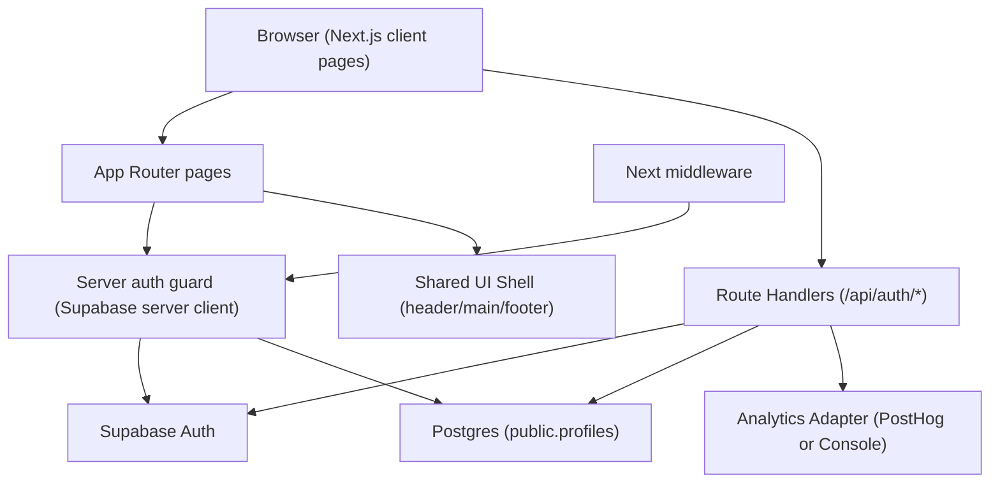

# Ashfall Case Library - Phase 1 Design Doc

**Phase:** Phase 1 - Foundation "Hello World"  
**Source Requirements:** `phases/phase-001/phase-001-requirements.md`  
**Date:** 2026-02-27  
**Status:** Draft

---

## 1) Purpose

Define how Phase 1 requirements will be implemented so coding can proceed without inventing architecture.

---

## 2) Locked Implementation Decisions

These decisions are fixed for Phase 1 unless this document is updated first.

1. Framework pattern: Next.js App Router with Route Handlers for auth mutations.
2. Auth/session source: Supabase Auth with cookie-backed server session checks.
3. Protected route enforcement: server-side guard in `/archive` page plus middleware session refresh.
4. Profile creation: Postgres trigger from `auth.users` to `public.profiles` using `raw_user_meta_data.callsign`.
5. Profile loading: server component query in `/archive/page.tsx`; no public profile API route in Phase 1.
6. Form validation: shared Zod schemas used by both client form and server route handlers.
7. Analytics approach: shared `trackEvent()` adapter with required event names; provider can be PostHog or console logger in Phase 1.
8. State model: route-driven auth flow states (`/apply` -> `/apply/review` -> `/apply/accepted`), no global client state library.

---

## 3) System Architecture Diagram



### 3.1 Runtime Boundaries

- Client components:
  - auth forms and button interactions
  - pending/error UI states
- Server components:
  - protected archive page auth check
  - profile fetch for display
- Route handlers:
  - apply, login, logout, password reset
  - error mapping and analytics emission
- Database layer:
  - profile persistence + constraints + RLS

---

## 4) Data Model

## 4.1 Tables in Phase 1

### `auth.users` (Supabase managed)
- Used for identity and session.
- Accessed through Supabase Auth APIs only.

### `public.profiles` (app-owned)
- `id uuid primary key` references `auth.users(id)` on delete cascade
- `callsign text not null unique`
- `created_at timestamptz not null default now()`

## 4.2 SQL DDL (target)

```sql
create table if not exists public.profiles (
  id uuid primary key references auth.users(id) on delete cascade,
  callsign text not null unique,
  created_at timestamptz not null default now()
);
```

## 4.3 Profile Auto-Creation Trigger

Trigger creates `profiles` row on `auth.users` insert.

```sql
create or replace function public.handle_new_user()
returns trigger
language plpgsql
security definer
set search_path = public
as $$
begin
  insert into public.profiles (id, callsign)
  values (
    new.id,
    coalesce(new.raw_user_meta_data ->> 'callsign', 'candidate_' || substr(new.id::text, 1, 8))
  );
  return new;
end;
$$;

drop trigger if exists on_auth_user_created on auth.users;
create trigger on_auth_user_created
after insert on auth.users
for each row execute procedure public.handle_new_user();
```

## 4.4 RLS Policies

```sql
alter table public.profiles enable row level security;

create policy "profiles_select_own"
on public.profiles for select
using (auth.uid() = id);

create policy "profiles_insert_own"
on public.profiles for insert
with check (auth.uid() = id);

create policy "profiles_update_own"
on public.profiles for update
using (auth.uid() = id)
with check (auth.uid() = id);
```

---

## 5) API Contracts

All Phase 1 mutation endpoints return JSON with this envelope:

```ts
type ApiSuccess<T> = { ok: true; data: T };
type ApiError = {
  ok: false;
  error: { code: AuthErrorCode; message: string };
};
```

`AuthErrorCode`:
- `INVALID_CREDENTIALS`
- `EMAIL_ALREADY_IN_USE`
- `WEAK_PASSWORD`
- `RATE_LIMITED`
- `UNKNOWN`

## 5.1 `POST /api/auth/apply`

### Request

```ts
type ApplyRequest = {
  email: string;
  password: string;
  callsign: string;
};
```

### Behavior

1. Validate payload with shared Zod schema.
2. Call `supabase.auth.signUp()` with:
   - `email`
   - `password`
   - `options.data.callsign = callsign`
3. Trigger creates profile row.
4. Emit events:
   - `auth_apply_submitted`
   - `auth_apply_succeeded` or `auth_apply_failed`
   - `profile_created` on success

### Success Response

```json
{
  "ok": true,
  "data": {
    "next": "/apply/review"
  }
}
```

### Auth Rule

- Public route (no existing session required).

## 5.2 `POST /api/auth/login`

### Request

```ts
type LoginRequest = {
  email: string;
  password: string;
};
```

### Success Response

```json
{
  "ok": true,
  "data": {
    "next": "/archive"
  }
}
```

### Auth Rule

- Public route.

## 5.3 `POST /api/auth/logout`

### Request
- Empty body.

### Success Response

```json
{
  "ok": true,
  "data": {
    "next": "/login"
  }
}
```

### Auth Rule

- Session required.

## 5.4 `POST /api/auth/reset-password`

### Request

```ts
type ResetPasswordRequest = {
  email: string;
};
```

### Behavior

- Always return generic success UI response to avoid account enumeration.

### Success Response

```json
{
  "ok": true,
  "data": {
    "message": "If an account exists, reset instructions were sent."
  }
}
```

### Auth Rule

- Public route.

## 5.5 Route-Level Auth Rules (Pages)

- Public:
  - `/`
  - `/apply`
  - `/apply/review`
  - `/apply/accepted`
  - `/login`
  - `/reset-password`
- Protected:
  - `/archive`

Unauthenticated access to `/archive` redirects to `/login`.

---

## 6) UI Structure

## 6.1 Route and Screen Map

1. `/` - lightweight landing with CTA to apply or log in.
2. `/apply` - application form (`email`, `password`, `callsign`).
3. `/apply/review` - "Application under review..." transitional state.
4. `/apply/accepted` - "Accepted" state with CTA to enter archive.
5. `/login` - login form.
6. `/reset-password` - reset password request form.
7. `/archive` - protected Archive Access screen with profile-driven callsign.

## 6.2 Shared Components

- `AppShell`
  - `Header` (brand + auth nav actions)
  - `Main`
  - `Footer`
- `AuthCard` layout wrapper for auth pages
- `AuthFormField` primitives
- `CallsignPanel` in archive page
- `StatusPanel` for "Case Library is coming soon"

## 6.3 UX Copy Constraints

- Product name shown as "Ashfall Case Library".
- Agency reference shown as "Ashfall Investigative Collective".
- Tone is procedural and professional, not playful.

---

## 7) State Management Approach

## 7.1 Server State

- Session:
  - Source of truth is Supabase auth session in cookies.
  - Refreshed by Next middleware.
- Profile:
  - Loaded server-side in `/archive/page.tsx`.
  - No client cache or global store in Phase 1.

## 7.2 Client State

- Form input and submit status managed locally per page with React state (`idle`, `submitting`, `error`).
- Route transitions represent onboarding states:
  - `/apply` -> `/apply/review` -> `/apply/accepted`

## 7.3 Why No Global Store

- Phase 1 has no cross-screen mutable domain state beyond auth session.
- Route boundaries and server-rendered fetches keep complexity lower.

---

## 8) Error Handling and Edge Cases

## 8.1 Error Mapping Strategy

- Supabase/provider errors are normalized to `AuthErrorCode`.
- UI never renders raw provider error text.

## 8.2 Edge Cases and Handling

1. Duplicate email on apply:
   - Return `EMAIL_ALREADY_IN_USE`.
   - Keep user on `/apply` with field-level error.
2. Duplicate callsign:
   - Trigger insert fails unique constraint.
   - Return mapped `UNKNOWN` (or dedicated mapped code if identifiable).
3. Profile missing on `/archive`:
   - Render fallback error state.
   - Emit `profile_load_failed`.
4. Invalid/expired session cookie:
   - redirect to `/login`.
5. Password reset request for unknown email:
   - return generic success message.
6. Network timeout on auth route:
   - show retryable error banner; preserve entered form fields.
7. Repeated submit clicks:
   - submit button disabled while request in progress.

---

## 9) Security Considerations

## 9.1 Auth and Authorization

- Server-side auth check required for `/archive`.
- RLS required on `public.profiles`.
- No privileged profile reads from client with service role keys.

## 9.2 Secrets and Environment

Required environment variables:
- `NEXT_PUBLIC_SUPABASE_URL`
- `NEXT_PUBLIC_SUPABASE_ANON_KEY`
- `SUPABASE_SERVICE_ROLE_KEY` (server only, only if needed for admin operations)
- `POSTHOG_API_KEY` (optional)
- `POSTHOG_HOST` (optional)

Rules:
- Service role key must never be exposed to client bundles.
- `.env*` files are gitignored.

## 9.3 Transport and Session Safety

- HTTPS required in production.
- Supabase auth cookies marked secure in production.
- CSRF risk minimized by same-site cookie defaults and server-side session checks.

---

## 10) Validation Strategy

## 10.1 Request Validation

- Shared Zod schemas for:
  - apply payload
  - login payload
  - reset payload
- Parse both client-side (for immediate feedback) and server-side (authoritative).

## 10.2 Database Validation

- DB constraints enforce:
  - `profiles.id` foreign key
  - unique `callsign`
  - not-null fields
- RLS enforces ownership reads/writes.

## 10.3 Case Validator Scope for Phase 1

- Case ingestion validators are out of scope for Phase 1.
- Placeholder module may exist as stub, but no runtime case schema validation is required this phase.

---

## 11) Test Strategy

## 11.1 Unit Test Targets (Vitest)

1. Zod schema validation for apply/login/reset payloads.
2. Auth error mapping function to `AuthErrorCode`.
3. Analytics event builder shape validation.

## 11.2 Component Test Targets (optional, RTL)

1. Apply form displays validation errors.
2. Auth submit button disabled during pending state.

## 11.3 E2E Test Targets (Playwright)

P0 required:
1. Apply flow:
   - user registers
   - sees `/apply/review`
   - reaches `/apply/accepted`
2. Login flow:
   - user logs in
   - reaches `/archive`
   - callsign is displayed
3. Protected route guard:
   - unauthenticated `/archive` redirects to `/login`
4. Session persistence:
   - refresh `/archive` while logged in stays authorized
5. Logout:
   - after logout, `/archive` redirects to `/login`

## 11.4 Non-Test Harness Verification

1. Manual RLS verification against second user account.
2. Production smoke test on Vercel URL for auth and protected route.

---

## 12) ADRs

## ADR-001: Use Route Handlers for Auth Mutations

- Context: Need consistent validation, error mapping, and telemetry.
- Decision: Use `/api/auth/*` route handlers instead of direct client SDK mutations.
- Consequence: Slightly more boilerplate, but stable server boundary and cleaner testability.

## ADR-002: Create Profiles via DB Trigger from `auth.users`

- Context: Need guaranteed profile creation tied to signup.
- Decision: Insert profile row through `auth.users` trigger using user metadata callsign.
- Consequence: Requires SQL migration and careful trigger logic; avoids client/service-role profile write race conditions.

## ADR-003: No Global Client State Library in Phase 1

- Context: Phase includes simple auth pages and one protected screen.
- Decision: Use local form state + server-rendered protected data only.
- Consequence: Lower complexity and fewer moving parts; can revisit in later phases if shared state grows.

---

## 13) Implementation Skeleton (Target File Layout)

```text
app/
  (public)/
    page.tsx
    apply/page.tsx
    apply/review/page.tsx
    apply/accepted/page.tsx
    login/page.tsx
    reset-password/page.tsx
  (protected)/
    archive/page.tsx
  api/auth/
    apply/route.ts
    login/route.ts
    logout/route.ts
    reset-password/route.ts
  layout.tsx
  middleware.ts
lib/
  supabase/
    browser.ts
    server.ts
  validation/
    auth.ts
  analytics/
    events.ts
    track.ts
components/
  app-shell.tsx
  auth/
    auth-card.tsx
    apply-form.tsx
    login-form.tsx
    reset-form.tsx
  archive/
    callsign-panel.tsx
supabase/
  migrations/
    <timestamp>_profiles.sql
tests/
  unit/
  e2e/
```

---

## 14) Open Items

1. Decide whether to enable email verification hard-gate in Phase 1 or keep soft-gated for faster onboarding.
2. Decide production analytics provider for Phase 1 (`PostHog` or console-only).
3. Decide if Sentry bootstrap is included in this phase (`P2`) or deferred.

