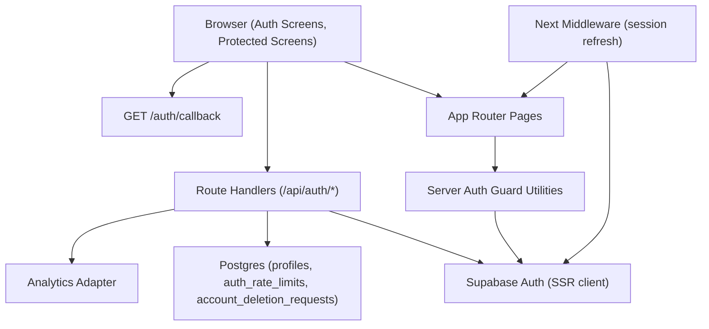

# Ashfall Case Library - Phase 2 Design Doc

**Phase:** Phase 2 - Authentication UX Hardening  
**Source Requirements:** `phases/phase-002/phase-002-requirements.md`  
**Date:** 2026-02-28  
**Status:** Draft

---

## 1) Purpose

Define exactly how Phase 2 auth hardening requirements will be implemented so execution does not invent architecture or contracts.

---

## 2) Locked Implementation Decisions

These decisions are fixed for Phase 2 unless this design doc is updated first.

1. Keep Next.js App Router + Route Handlers for all auth mutations (`/api/auth/*`).
2. Keep Supabase Auth as source of truth for identity/session and cookie-backed SSR sessions.
3. Upgrade auth-state detection in layout from cookie-presence heuristic to server-validated user lookup via Supabase.
4. Continue server-side protected-route enforcement in page/server boundaries (not client-only guards).
5. Add deterministic post-login redirect via sanitized `next` query/path contract.
6. Add explicit email verification enforcement in login path (`email_confirmed_at` gate).
7. Add auth callback route (`/auth/callback`) for verification and reset link code exchange.
8. Split password reset into two concrete actions:
   - request reset link
   - confirm new password with recovery session
9. Implement minimal abuse protection with Postgres-backed rate limiting (shared utility used by login, reset request, verification resend).
10. Extend auth error mapping to a Phase 2 enum that drives all user-facing auth copy.
11. Keep local form state in components; do not add a global client state library.
12. Keep analytics adapter pattern and update phase/event contract for Phase 2.

---

## 3) System Architecture Diagram



### 3.1 Runtime Boundaries

- Client components:
  - form input, submit state, field errors, confirmation banners
  - navigation interactions and logout trigger
- Server components/pages:
  - resolve authenticated user
  - enforce protected-route redirect
  - fetch protected profile data for archive/candidate file
- Route handlers:
  - validation, rate-limit check, Supabase auth mutation, mapped response envelope
  - analytics event emission for success/failure flows
- Postgres:
  - profile ownership data
  - rate-limit counters/windows
  - account deletion request records

### 3.2 Request Flow Summary

1. Browser submits auth form to `/api/auth/*`.
2. Route handler validates payload (Zod) and applies rate-limit check where required.
3. Route handler calls Supabase Auth and maps errors to phase error enum.
4. Handler returns structured `ApiSuccess` or `ApiError`.
5. UI transitions via route push or in-place status messaging.
6. Protected pages resolve session server-side; unauthenticated users are redirected to login with safe `next`.

---

## 4) Data Model

## 4.1 Existing Table (retained)

### `public.profiles`
- `id uuid primary key` -> `auth.users(id)` (`on delete cascade`)
- `callsign text not null`
- `created_at timestamptz not null default timezone('utc', now())`

Phase 2 change:
- enforce case-insensitive uniqueness for callsign (`unique index on lower(callsign)` or equivalent).

## 4.2 New Table: Rate Limit Ledger

### `public.auth_rate_limits`
- `id bigserial primary key`
- `action text not null` (`login` | `password_reset` | `verification_resend`)
- `subject_hash text not null` (HMAC/hash of email/IP-derived key; no raw email stored)
- `attempt_count integer not null default 0`
- `window_started_at timestamptz not null`
- `blocked_until timestamptz null`
- `created_at timestamptz not null default timezone('utc', now())`
- `updated_at timestamptz not null default timezone('utc', now())`

Indexes/constraints:
- unique (`action`, `subject_hash`)
- index on `blocked_until` for pruning/lookups

## 4.3 New Table: Account Deletion Requests

### `public.account_deletion_requests`
- `id uuid primary key default gen_random_uuid()`
- `user_id uuid not null references auth.users(id) on delete cascade`
- `status text not null default 'pending'`
- `requested_at timestamptz not null default timezone('utc', now())`
- `confirmed_at timestamptz not null default timezone('utc', now())`
- `reason text null`

Constraints:
- `status` enum-like check: `pending | processed | rejected`
- partial unique index to prevent duplicate active pending requests per user

## 4.4 RLS Policies

### `public.profiles`
- Keep existing ownership policies:
  - select own row only
  - insert own row only
  - update own row only

### `public.account_deletion_requests`
- enable RLS
- select own requests only (`auth.uid() = user_id`)
- insert own request only (`auth.uid() = user_id`)
- no delete policy in Phase 2 (admin/backoffice flow deferred)

### `public.auth_rate_limits`
- no direct client access
- RLS enabled with no anon/authenticated select policies
- writes/reads performed through server-side utility using privileged path:
  - either `security definer` RPC
  - or server-only client with service role (never exposed to browser)

## 4.5 Rate Limit Function Contract

Internal utility contract (DB or app abstraction):

```ts
type RateLimitAction = "login" | "password_reset" | "verification_resend";

type RateLimitResult = {
  allowed: boolean;
  retryAfterSeconds: number;
};
```

Behavior:
- increment attempts within window
- set `blocked_until` when threshold exceeded
- return deterministic retry value for API/UI messaging

---

## 5) API Contracts

All auth mutation endpoints return:

```ts
type ApiSuccess<T> = { ok: true; data: T };

type ApiError = {
  ok: false;
  error: {
    code: AuthErrorCode | "VALIDATION_ERROR";
    message: string;
    fieldErrors?: Record<string, string[] | undefined>;
    retryAfterSeconds?: number;
  };
};
```

`AuthErrorCode` for Phase 2:
- `INVALID_CREDENTIALS`
- `EMAIL_ALREADY_IN_USE`
- `CALLSIGN_ALREADY_IN_USE`
- `WEAK_PASSWORD`
- `RATE_LIMITED`
- `UNVERIFIED_EMAIL`
- `TOKEN_INVALID_OR_EXPIRED`
- `SERVICE_UNAVAILABLE`
- `UNKNOWN`

## 5.1 `POST /api/auth/apply`

Request:

```ts
type ApplyRequest = {
  email: string;
  password: string;
  callsign: string;
};
```

Behavior:
1. Validate with shared `applySchema`.
2. Call `supabase.auth.signUp` with:
   - `email`, `password`
   - `options.data.callsign`
   - verification redirect target pointing to `/auth/callback?next=/apply/accepted`
3. Map duplicate email to neutral copy path.
4. Return next route for review/verification messaging.

Success response:

```json
{
  "ok": true,
  "data": {
    "next": "/apply/review",
    "requiresVerification": true
  }
}
```

Auth rule:
- Public route.

## 5.2 `POST /api/auth/login`

Request:

```ts
type LoginRequest = {
  email: string;
  password: string;
  next?: string;
};
```

Behavior:
1. Validate with `loginSchema`.
2. Run rate-limit check for action `login`.
3. `supabase.auth.signInWithPassword`.
4. If user exists but email unverified, sign out recovery/session, return `UNVERIFIED_EMAIL`.
5. Determine redirect target from safe `next` (default `/archive`).

Success response:

```json
{
  "ok": true,
  "data": {
    "next": "/archive"
  }
}
```

Auth rule:
- Public route.

## 5.3 `POST /api/auth/logout`

Request:
- Empty body.

Behavior:
- Invalidate server session via Supabase sign out.

Success response:

```json
{
  "ok": true,
  "data": {
    "next": "/"
  }
}
```

Auth rule:
- Authenticated session expected; endpoint remains safe if session already missing.

## 5.4 `POST /api/auth/reset-password`

Purpose:
- Request reset email (neutral regardless of account existence).

Request:

```ts
type ResetPasswordRequest = {
  email: string;
};
```

Behavior:
1. Validate with reset-request schema.
2. Rate-limit check for action `password_reset`.
3. Call `supabase.auth.resetPasswordForEmail` with redirect to `/auth/callback?next=/reset-password/update`.
4. Always return neutral success message.

Success response:

```json
{
  "ok": true,
  "data": {
    "message": "If an account exists for this email, you'll receive reset instructions."
  }
}
```

Auth rule:
- Public route.

## 5.5 `POST /api/auth/reset-password/confirm`

Purpose:
- Complete password update using recovery session established by callback.

Request:

```ts
type ResetPasswordConfirmRequest = {
  newPassword: string;
  confirmPassword: string;
};
```

Behavior:
1. Validate schema + password match.
2. Require active recovery/auth session.
3. Call `supabase.auth.updateUser({ password: newPassword })`.
4. On success, return redirect to login with reset success hint.

Success response:

```json
{
  "ok": true,
  "data": {
    "next": "/login?reset=success"
  }
}
```

Auth rule:
- Recovery/auth session required.

## 5.6 `POST /api/auth/verification/resend`

Request:

```ts
type VerificationResendRequest = {
  email: string;
};
```

Behavior:
1. Validate schema.
2. Rate-limit check for action `verification_resend`.
3. Call Supabase resend verification email.
4. Return neutral success.

Success response:

```json
{
  "ok": true,
  "data": {
    "message": "If the account is eligible, a new verification email has been sent."
  }
}
```

Auth rule:
- Public route.

## 5.7 `POST /api/auth/account-deletion-request`

Request:

```ts
type AccountDeletionRequest = {
  confirmationText: "DELETE";
  reason?: string;
};
```

Behavior:
1. Require authenticated user.
2. Validate explicit confirmation token/value.
3. Insert pending request row for current user.
4. Emit analytics event.

Success response:

```json
{
  "ok": true,
  "data": {
    "message": "Account deletion request received."
  }
}
```

Auth rule:
- Authenticated route.

## 5.8 `GET /auth/callback`

Purpose:
- Handle Supabase email-link code exchange for verification/recovery and then redirect.

Query parameters:
- `code` (required from Supabase)
- `next` (optional, sanitized relative path)
- `type` (optional hint from provider context)

Behavior:
1. Exchange code for session (`exchangeCodeForSession`).
2. On success, redirect to safe `next`.
3. On failure, redirect to route with user-safe error query (`/login?auth_error=link_invalid` or `/reset-password?auth_error=link_invalid`).

Auth rule:
- Public callback route.

## 5.9 Page-Level Auth Rules

Public pages:
- `/`
- `/apply`
- `/apply/review`
- `/apply/accepted`
- `/login`
- `/reset-password`
- `/reset-password/update`
- `/legal/privacy`
- `/legal/terms`

Protected pages:
- `/archive`
- `/candidate-file`

Redirect rule:
- unauthenticated protected access -> `/login?next=<safe_relative_path>`

---

## 6) UI Structure

## 6.1 Route and Screen Map

1. `/` - public entry with apply/login CTAs.
2. `/apply` - registration form with password requirement guidance and validation.
3. `/apply/review` - verification-pending screen, resend verification action.
4. `/apply/accepted` - post-verification success state, CTA to login/archive.
5. `/login` - login form with generic failure copy and `next` preservation.
6. `/reset-password` - forgot-password request form.
7. `/reset-password/update` - new password + confirm form for recovery session.
8. `/archive` - protected archive landing.
9. `/candidate-file` - protected profile/account actions (including deletion request entry point).
10. `/legal/privacy` and `/legal/terms` - static legal content surfaces linked from auth screens.

## 6.2 Key Components

- `AppShell`
  - server-validated nav state
  - authenticated links: `Archive`, `Candidate File`, `Log Out`
  - unauthenticated links: `Apply`, `Log In`
- `ApplyForm`
  - inline password requirements block
  - field-level errors + general status
- `LoginForm`
  - hidden/sanitized credential failure semantics
  - optional redirect target propagation
- `ResetPasswordForm` (request)
- `ResetPasswordUpdateForm` (confirm)
- `VerificationPendingPanel`
  - resend verification action + cooldown messaging
- `AccountDeletionRequestCard`
  - explicit confirmation UX
- `AuthMessageBanner`
  - session-expired, reset-success, verification-required message states

## 6.3 UX Copy Constraints

Mandatory user-facing messages:
- Duplicate email apply: `An account may already exist for this email.`
- Login invalid: `Invalid email or password.`
- Unverified login: `Please verify your email before accessing the Archive.`
- Expired verification link: `Verification link expired.`
- Session expired: `Your session has expired. Please log in again.`
- Reset request neutral: `If an account exists for this email, you'll receive reset instructions.`
- Reset token invalid/expired: `Reset link expired or invalid.`

No raw provider strings are rendered in UI.

---

## 7) State Management Approach

## 7.1 Server State

- Source of truth for auth state:
  - Supabase session/user fetched server-side.
- Protected pages call shared guard helper:
  - resolve user
  - redirect unauthenticated users with safe `next`
- Middleware remains responsible for session refresh/cookie synchronization.

## 7.2 Client State

- Per-form local React state only:
  - fields
  - `isSubmitting`
  - field errors
  - general error/success banners
- Query-param driven status cues:
  - `next`
  - `auth_error`
  - `reset=success`
  - `session=expired`

## 7.3 Redirect State Rules

- `next` is carried from protected redirect to login submission payload.
- `next` must be sanitized to internal relative path:
  - starts with `/`
  - not `//`
  - not absolute URL
  - optional allowlist for protected destinations

## 7.4 Why No Global Store

- Phase 2 auth flows do not require shared client domain state beyond route/query-driven flow.
- Keeping local state + SSR user checks reduces complexity and hydration risk.

---

## 8) Error Handling and Edge Cases

## 8.1 Error Mapping Strategy

1. Route handler catches upstream/provider errors.
2. Error mapper normalizes to Phase 2 `AuthErrorCode`.
3. API returns structured error payload.
4. UI maps error code to approved message text.

## 8.2 Edge Cases and Handling

1. Duplicate email on apply:
   - map to `EMAIL_ALREADY_IN_USE`
   - show neutral duplicate-account message + recovery CTAs
2. Duplicate callsign:
   - DB unique violation maps to `CALLSIGN_ALREADY_IN_USE`
3. Unverified login:
   - map to `UNVERIFIED_EMAIL`
   - block protected access; offer resend verification
4. Expired/invalid verification link:
   - callback redirects to verification-expired UI
5. Password reset token expired/reused:
   - map to `TOKEN_INVALID_OR_EXPIRED`
   - present request-new-link CTA
6. Rate-limited action:
   - return `RATE_LIMITED` and `retryAfterSeconds`
   - disable repeat submit until cooldown
7. Session expired on protected page:
   - redirect to login with `session=expired`
8. Supabase outage/timeouts:
   - map to `SERVICE_UNAVAILABLE`
   - generic retry guidance
9. Network failure in browser:
   - non-destructive retry messaging; preserve form input
10. Back button after logout:
   - server-side guard prevents protected content render

---

## 9) Security Considerations

## 9.1 Auth and Authorization

- Server-validated auth checks on protected pages.
- Session cookies managed via Supabase SSR clients.
- Protected data reads/writes gated by RLS and auth checks.

## 9.2 Account Enumeration Resistance

- Apply/login/reset responses do not reveal account existence.
- Neutral copy for duplicate and reset request outcomes.
- No per-condition wording that differentiates unknown vs known user emails.

## 9.3 Session Safety

- HTTP-only cookies; no auth token storage in local/session storage.
- `Secure` in production and `SameSite` at least `lax`.
- Logout invalidates session and protected content access.

## 9.4 Rate Limit Privacy and Integrity

- Rate-limit key is hashed (email/IP-based normalized input) before persistence.
- No raw sensitive identifiers stored in limiter table.
- Threshold/window/cooldown controlled by server env config.

## 9.5 Redirect and Input Safety

- `next` redirect input sanitized to prevent open redirects.
- All request payloads schema-validated server-side.
- API responses return standardized error envelopes only.

## 9.6 RLS and Data Access

- `profiles` remains ownership-scoped via RLS.
- `account_deletion_requests` limited to user-owned rows.
- `auth_rate_limits` not directly queryable from browser clients.

---

## 10) Validation Strategy

## 10.1 Request Schema Validation (Zod)

Extend `lib/validation/auth.ts` with explicit schemas:
- `applySchema`
- `loginSchema` (adds optional `next` with safe-path rule)
- `resetPasswordRequestSchema`
- `resetPasswordConfirmSchema` (`newPassword`, `confirmPassword`, equality refinement)
- `resendVerificationSchema`
- `accountDeletionRequestSchema`

Client usage:
- pre-submit immediate feedback.

Server usage:
- authoritative parsing in every auth route handler.

## 10.2 Database Validation

- Keep `profiles_callsign_format` check constraint.
- add case-insensitive uniqueness for callsign.
- add check constraints for enum-like status/action columns.
- enforce FK integrity for deletion requests.

## 10.3 Validation Order

1. Parse request body (JSON shape safety).
2. Zod validate and normalize.
3. Rate-limit guard (for applicable actions).
4. Execute auth mutation/query.
5. Map error and return safe response envelope.

## 10.4 Case Validators

- Case Bible and case-ingestion validators remain out of scope for Phase 2.
- No new case schema logic introduced in this phase.

---

## 11) Test Strategy

## 11.1 Unit Test Targets (Vitest)

1. Auth schema validation:
   - login `next` sanitization
   - reset confirm password matching
   - resend/account deletion schemas
2. Auth error mapper:
   - `UNVERIFIED_EMAIL`
   - `TOKEN_INVALID_OR_EXPIRED`
   - `SERVICE_UNAVAILABLE`
   - duplicate callsign mapping
3. Rate-limit utility:
   - threshold, cooldown, retry-after behavior
4. Redirect utility:
   - rejects open redirect payloads
5. Analytics event contract:
   - Phase 2 phase tag and new event payloads

## 11.2 Component Test Targets (RTL)

1. App shell nav visibility by auth state.
2. Apply form shows password requirements and duplicate-email recovery links.
3. Login form preserves/forwards `next`.
4. Reset update form handles mismatch/invalid token errors.
5. Account deletion request confirmation gate.

## 11.3 E2E Test Targets (Playwright)

P0 coverage:
1. Register -> verify callback -> login -> protected archive.
2. Duplicate registration attempt shows neutral message + CTAs.
3. Invalid login shows generic message.
4. Unverified login blocked with resend option.
5. Password reset request -> callback -> password update success.
6. Expired/invalid reset token path.
7. Logout -> protected route blocked.
8. Session-expired redirect message path.

## 11.4 Non-Harness Verification

1. SQL verification of new migrations, constraints, and RLS policies.
2. Manual smoke test with real Supabase verification/reset emails in preview/prod.
3. Security check:
   - no auth tokens in localStorage/sessionStorage
   - open redirect negative tests on `next`

---

## 12) ADRs

## ADR-201: Add Dedicated `/auth/callback` for Email Link Flows

- Context: Verification and reset links need explicit session/code exchange and predictable redirects.
- Decision: Add `GET /auth/callback` route that exchanges Supabase `code` and applies safe redirect behavior.
- Consequence: Centralizes link-flow handling; reduces per-screen auth token parsing complexity.

## ADR-202: Postgres-Backed Rate Limiting for Auth Actions

- Context: Phase 2 requires rate limiting for login/reset with deterministic behavior across requests.
- Decision: Store limiter windows in Postgres (hashed subject keys) and gate in route handlers.
- Consequence: Slight DB complexity increase; predictable anti-abuse behavior in shared environments.

## ADR-203: Keep Route Handlers as Single Auth Mutation Boundary

- Context: Need consistent validation, telemetry, and error normalization.
- Decision: Continue using `/api/auth/*` handlers instead of direct client SDK mutations.
- Consequence: More explicit server boundary; easier to test and secure.

## ADR-204: Enforce Safe Internal Redirects via `next` Sanitization

- Context: Protected-route intent preservation introduces redirect input risk.
- Decision: Accept only sanitized relative `next` paths and default to known safe routes.
- Consequence: Prevents open redirect issues while preserving UX continuity.

---

## 13) Implementation Skeleton (Target File Layout)

```text
app/
  (public)/
    apply/page.tsx
    apply/review/page.tsx
    apply/accepted/page.tsx
    login/page.tsx
    reset-password/page.tsx
    reset-password/update/page.tsx
    legal/privacy/page.tsx
    legal/terms/page.tsx
  (protected)/
    archive/page.tsx
    candidate-file/page.tsx
  api/auth/
    apply/route.ts
    login/route.ts
    logout/route.ts
    reset-password/route.ts
    reset-password/confirm/route.ts
    verification/resend/route.ts
    account-deletion-request/route.ts
  auth/
    callback/route.ts
  layout.tsx
  middleware.ts
lib/
  auth/
    error-codes.ts
    error-mapper.ts
    redirects.ts
    rate-limit.ts
  validation/
    auth.ts
  analytics/
    events.ts
    track.ts
  supabase/
    browser.ts
    server.ts
    middleware.ts
supabase/
  migrations/
    <timestamp>_phase2_auth_hardening.sql
tests/
  unit/
  e2e/
```

---

## 14) Open Items

1. Choose exact rate-limit thresholds and window/cooldown defaults for Phase 2 (`login`, `password_reset`, `verification_resend`).
2. Decide whether account deletion request should notify an email/support channel immediately or only persist in DB for now.
3. Confirm final legal content owners for Terms/Privacy page text.
